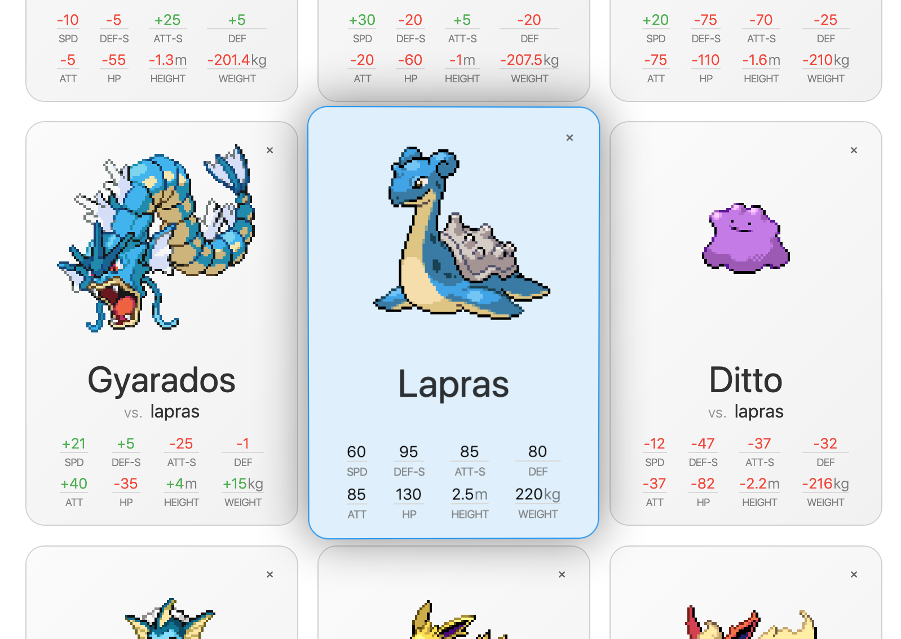

# Pokedex

Demo project for LB. [Live demo](https://mlajtos.github.io/lb-pokedex/build/#/pikachu+charizard+mewtwo+blastoise+charmander+bulbasaur+psyduck+cubone)

[](https://mlajtos.github.io/lb-pokedex/build/#/pikachu+charizard+mewtwo+blastoise+charmander+bulbasaur+psyduck+cubone)

## Feature Wishlist

1. _"Click to compare stats"_ hint.
1. Clear selection with one click.
1. Flip-over card to show extra info, e.g. description text.

## Known Bugs

### User-facing Bugs

1. Tilt
    - Not really smooth transition from stationary to tilted.
    - After deleting a card, there is no tilting on the card that took its place.
        - `onMouseEnter` event is skipped (in Chrome, FF is fine).
    - Shadow is cut-off when animating to stationary position.
        - `zIndex` is changed back to zero way too early.
1. No A11Y.
    - At least `aria` attributes would be nice.
1. Mobile support is sub-optimal.
    - Only one card can be selected.
    - No tilt.
        - Hmm, [DeviceMotionEvent.acceleration](https://developer.mozilla.org/en-US/docs/Web/API/DeviceMotionEvent/acceleration)?
1. Adding/removing cards should be animated. Maybe reorder.
    - Animating grid items is nightmare even with `TransitionGroup`.
    - [aholachek/animate-css-grid](https://github.com/aholachek/animate-css-grid), [STRML/react-grid-layout](https://github.com/STRML/react-grid-layout)
1. More bling – [Trianglify](http://qrohlf.com/trianglify/)

### Developer-facing Bugs

1. Anonymous components are crappy in DevTools.
    - Quick fix:
        - `export default () => {}` change to `export default function Component() {}`
    - Proper fix:
        - Babel could read dirname where `index.js` is located and use that. Too much work.
1. Ton of non-optimized code.
    - Moar memo!
1. `App.js` is getting bloated by `useState()`.
    - `useReducer()`
1. BEM "bug"
    - Using `Block_element__modifier` template:
        - `Block` is PascalCase to match name of the React component
        - `element` is camelCase and prefixed with one underscore
        - `modifier` is camelCase and prefixed with two underscores
    - Intentionally not using this SASS scoping:
        ```sass
        .Block {
            &_element {
                &__modifier {

                }
            }
        }
        ```